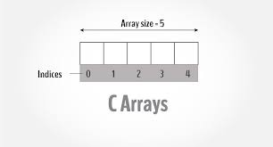
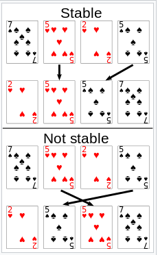

# 
### Introduccion
[Definicion y creacion de un ARRAY](#arrayarreglos)    
[Seleccion de elementos](#seleccion-de-elementos-de-un-array)  
### Metodos BASICOS
* [PUSH](#arraypush)  
* [POP](#arraypop)    
* [UNSHIFT](#arrayunshift)    
* [SHIFT](#arrayshift)    
* [REVERSE](#arrayreverse)    
* [SPLIT](#stringsplit)   
* [SORT](#arraysort)  
* [JOIN](#arrayjoin)  
* [INDEXOF](#arrayindexof)    
* [SPLICE](#arraysplice)
---
# Array/arreglos

Array es una objeto global de **Javascript** que almacena valores del mismo tipo, llamadas listas de alto nivel.
>Contiene varios elementos del mismo tipo.
>Cada elemento esta asociado a un indice.

# Creacion de Array

>Declaracion de array y datos de la lista:

```javascript
var array_1=[0,1,2,3,4];
```

>Declaracion de array y datos de la lista usando el **ArrayConstructure**

```javascript
var array_2=new Array("A","B","C");
```

>Declaracion de arrat y **cantidad** de datos

```javascript
var array_3=new Array(7);
//La cantidad de elementos del array es : 7, empty slot
```

# Seleccion de elementos de un ARRAY

Segun lo indicado, cada elemento del array se encuentra asociado con un indice.
>Toda lista inicia con el indice 0.



Ejemplo:

```javascript
var list =["Lechuga","Arroz","Cereales","Carne"];
```

Para esta lista, deseamos seleccionar el elemento "Lechuga":

```javascript
document.write(list[0]);

//Imprime en pantalla : Lechuga
```

Ahora seleccionamos el elemento "Carne";

```javascript
document.write(list[3]);

//Imprime en pantalla : Carne
```

# Array.push

> Annade uno o mas elementos al final de un ARRAY y devuelve la nueva **longitud** del ARRAY.

```javascript
var colores=["Rojo","Verde"];
console.log(colores)    //Expected output: ["Rojo","Verde"]
var new_colores=colores.push("Azul","Amarillo");
console.log(colores)    //Expected oputput: ["Rojo","Verde","Azul","Amarillo"]
console.log(new_colores) //Expected output: 4
```

# Array.pop

>Eliminar el ultimo elemento del Array y lo devuelve.Este metodo modifica la longitud del ARRAY.

```javascript
var colores=["Rojo","Verde","Azul","Amarillo"];
console.log(colores.pop());
//expected output: "Amarillo"

console.log(colores)
//Expected output: ["Rojo","Verde,"Azul"]

colores.pop()
console.log(colores);
//expected output: ["Rojo","Verde"];
```

# Array.unshift

>Annade uno mas elementos al inicio del ARRAY y devuelve la nueva **Longitud** del ARRAY.

```javascript

var numeros=[1,2,3,4,5,6];
console.log(numeros.unshift(-1,0));
//expected output: 8
console.log(numeros);
//expected output: [-1,0,1,2,3,4,5,6]
```

# Array.shift

>Elimina el primer elemento (con indice: 0 )del ARRAY y retorna.

```javascript

var numeros=[1,2,3,4,5,6];
console.log(numeros.shift());
//expected output: 1
console.log(numeros)
//expected output: [2,3,4,5,6];
```

# Array.reverse

>El metodo reverse **invierte** el orden de los elemntos en el ARRAY.El ultimo elemento pasa a ser el primero y el primero pasa a ser el ultimo.

```javascript
var numeros=[1,2,3,4,5,6];
var reversed =numeros.reverse()

console.log(numeros);
//expected output: [6,5,4,3,2,1];
```

# String.split

>Convierte una cadena de texto en un ARRAY de cadenas usando un separador indicado.

```javascript
var text="Lorem ipsum dolor sit amet consectetur adipisicing elit";
var espacio=" ";
var arr=text.split(espacio);
document.write(arr);
//expected output: Lorem,ipsum,dolor,sit,amet,consectetur,adipisicing,elit
console.log(arr);
//expected output: ['Lorem', 'ipsum', 'dolor', 'sit', 'amet', 'consectetur', 'adipisicing', 'elit']
```

# Array.sort

>Metodo que ordena los elemntos de un ARRAY de forma local y lo devuelve ordenado.La ordenacion no es necesariamente **ESTABLE**.

  

``` TXT
Los algoritmos de clasificación estable clasifican elementos iguales en el mismo orden en que aparecen en la entrada. Por ejemplo, en el ejemplo de clasificación de cartas a la derecha, las cartas se clasifican por su rango y se ignora su palo. Esto permite la posibilidad de múltiples versiones diferentes ordenadas correctamente de la lista original. Los algoritmos de clasificación estables eligen uno de estos, de acuerdo con la siguiente regla: si dos elementos se comparan como iguales (como las dos cartas de 5), entonces se conservará su orden relativo, es decir, si uno viene antes que el otro en la entrada, vendrá antes que el otro en la salida.
```

>Tener en cuenta el orden del sistema **`Unicode`**.

``` javascript
var numeros=[1,2,10,21,3,40];

var arr_ordenado=numeros.sort();

document.write(arr_ordenado);

//expected output :[1,10,2,21,3,40]

```

```javascript
    var arr = [ 'a', 'b', 'Z', 'Aa', 'AA' ];
    arr.sort();  
    //[ 'AA', 'Aa', 'Z', 'a', 'b' ]
```

Un array ordenado,sin usar funcion de ordenado.

```javascript
var num=[1,11,7,4,21];
var num_ordenado=num.sort();
document.write(num_ordenado);
//expected output: [1,11,21,4,7]
```

Un array ordenado ,usando funcion de ordenado ascendente.

```javascript
var num=[1,11,7,4,21];

function comparar(a,b){return a-b};

var num_ordenado=num.sort(comparar);

document.write(num_ordenado);

//expected output: [1,4,7,11,21]

```

# Array.join

>Une todos los elementos de una matriz `ARRAY` en una cadena y devuelve la cadena.No destructivo.

## `Sintaxis`

```javascript
arr.join([separador])
//separador: OPCIONAL
```

* `Separador` :es una cadena que sirve para separar cada elemento, en el momento de realizar la union de los elementos.Se mostrara algunos ejemplos:

---

```javascript
    var meses=['Enero','Febrero','Diciembre'];

    console.log(meses.join());
    //expected output: "Enero,Febrero,Diciembre"

    console.log(meses.join(""));
    //expected output: "EneroFebreroDiciembre"

    console.log(meses.join("-"));
    //expected output: "Enero-Febrero-Diciembre"
```

# Array.indexOf

>Metodo que retorna el primer indice del elemento que encuentra de un array, retorna -1 si no existe tal elemento.

## `Sintaxis`

```js
array.indexOf(Element,Indice_desde);
```


* `Element`: Elemento del cual se obtiene el indice.Retorna -1 si no existe.
* `Indice_desde`: Indica el indice desde donde inicia la busqueda de `Element`
---
```js
    var array = [2, 9, 9];
    array.indexOf(2);     // 0
    array.indexOf(7);     // -1
    array.indexOf(9, 2);  // 2
    array.indexOf(2, -1); // -1
    array.indexOf(2, -3); // 0
```
# Array.splice

> Metodo que cambia el contenido de un array eliminando elementos existentes y/o  agregando nuevos.

### `Sintaxis`

```js
array.splice(start[, deleteCount[, item1[, item2[, ...]]]])
```
* `start` : Indice donde se cambiara el o los elementos.
* `deleteCount` : un numero entero que indica la cantidad de elemntos que van a cambiar en el array antiguo.
* `item1` : elementos que se agregaran al array.Si no se indica item unicamente se eliminara el elemento.
---

```js
var myFish = ['angel', 'clown', 'drum', 'sturgeon'];
var removed = myFish.splice(2, 1, 'trumpet');

// myFish is ["angel", "clown", "trumpet", "sturgeon"]
// removed is ["drum"]
```
